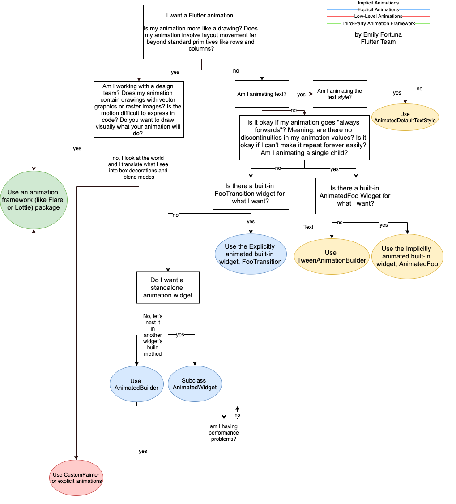

## Why using animations? 
- For User Experiences.

### Five of Animation's Key in Flutter
1. Animation Controller
   - Responsible to control animation cycle. repeat / forward / reverse ..etc
   - 애니메이션을 조작하기위한 컨트롤러
   - 애니메이션이 동하 멈추고 반복하고 등의 동작을 수행시킴 
2. Animation
   - Value that changes over time and can be used to animate widget or other app elements.
   - 움직이는 위젯이나 페이지를 구성하는 값. 
   - 위젯 또는 앱의 엘리먼트가 됨
3. Tween
   - Values between which an animation can interpolate, such as a variety of colors, angles, sizes, integers.
   - 애니메이션의 시작과 끝 사이에서 채워 넣어질 값들.
   - eg. (0,0) -> (10, 20)으로 이동하면 (1,2), (2,4), (4,6) ..... 의 값들 
4. AnimatedFoo / FooTransition Widget 
   - Widgets that are used for different animations type
5. Animated Builder
   - a Widget that gives developers more precise animation control, enabling them to set unique animations for their widgets. 
   - Animated Builder안에 Widget을 넣고 애니메이션을 실행  


## Concepts of Animation in Flutter
### Duration
애니메이션의 동작은 시작 시간과 끝나는 시간을 기반으로 작동한다.
The time it takes to complete an animation is referred to as the animation's duration.
Flutter에서 Duration 객체는 microseconds, milliseconds, seconds, minutes, hours, days 등을 넣어 정의한다.

### Curves
애니메이션의 행동을 정의한다. 
Curves are mathematical operations that control the duration progress of an animation.
Curves.linear, Curves.easeIn, Curves.easeOut, and Curves.easeInOut are just a few of the built-in curves offered by Flutter 
These curves can be used to create a variety of effects, including gradual acceleration and deceleration acceleration. 

### Interpolation
Interpolation is used to create smooth transitions between the starting and ending states of an animation

# Animation Types in Flutter 

### implicit 
- no need to Control it 
- Implicit are frequently less complex and take less coding to implement than explicit animations, but they may be less customization in terms of the duration, curve, and other aspects of the animation. 

### Explicit 
- more complex than implicit
- need to Control it
- Explicit are animations that are triggered manually by the developer, such as when a button is pressed or when a certain condition is met. In an explicit animation, the developer is responsible fir specifying the animation's duration, curve, and other properties.

### Low level Animation
- Need to create and Control it
- Custom Painter 
- Determine path, points, angles etc ..

### Third party animation framework
- put and go (using 3rd party library)
- Flare or Lottie

# [Flutter Animation Tree](https://docs.flutter.dev/ui/animations)



# Animation Basic 
## Animation Controller Overview

### Animation Controller 
**Animation Controller** is controller that used to control animation of the widget.
- start of animation
- process of the animation and the status of the anmation
- stop to animation 

> eg. Animation Controller
   ```dart
   final AnimationController _myController = AnimationController(
     duration: const Duration(second: 5), // 애니메이션이 작동하는 기간 
     vsync: this,  // from TickerProvider
   )l
   ```
- vsync : refresh rate of screen, 화면을 더 부드럽게 연결하기 위해 디스플레이와의 수직동기화

### Animation Controller Process
**myController.forward()**
- To start animation
- 호출 시 애니메이션 시작
**myController.reverse()**
- reverse back the animation from the current position
- 호출 시 현재 위치에서부터 처음으로 뒤돌아감. rewi nd
**myController.dispose()**
- we need to dispose of the animation controller when it is no longer needed (Keep memory free)
- 화면에서 필요 없으면 dispose 하여서 메모리상에서 제거

## Deep in Animation Controller 
*What are animation controller properties?**
### Status 
- an enum that represents the current status of the animation
  AnimationStatus 
  - forward : 애니메이션이 시작지점부터 끝지점까지 작동되고 있는 상태, 값은 0.0 ~ 1.0 으로 증가   
  - revers : 애니메이션이 끝지점부터 시작지점까지 뒤로 돌아가는 상태, 값은 1.0 ~ 0.0 으로 감소  
  - completed : 애니메이션이 시작하여 끝까지 진행된 상태, 값은 항상 1.0
  - dismissed : 애니메이션이 아직 시작하지 않았거나 reverse가 완료된 상태, 감은 항상 0.0 
### Listeners 
애니메이션의 상태값 관찰 
- addListener : 애니메이션 컨트롤러에 listener 등록  
- removeListener : 애니메이션 컨트롤러에서 listener 제거
```dart
// 리스너 생성
VoidCallback listener = () {
  ... 
};
// 리스너 등록
_animationController.addListener(listener);
// 리스너 제거
_aniamtionController.removeListener(listener); 
```
### Value
double 형태의 값으로 애니메이션의 현재 값을 나타냄 
값의 범위는 0.0 ~ 1.0 사이이며 
0.0일 때는 시작점, 1.0일 때는 끝점을 나타냄
```dart
_animationController = AnimationController(
  duration: Duration(seconds: 1),
  vsync: this,
);

// interpolate 할 값의 시작과 끝
// animationController의 값은 animation의 값을 end값으로 나눈 것과 같음
// eg. animation 0.0 / animationController 0.0
// animation 3.0 / animationController 0.25
// animation 6.0 / animationController 0.5
// animation 9.0 / animationController 0.75
// animation 12.0 / animationController 1.0
_animation = Tween(begin: 0.0, end: 12.0).animate(_animationController);
// 0.5로 설정하여 애니메이션의 상태를 중간으로 만듬 
_animationController.value = 0.5; // tween 값의 중간은 6

_animationController.forward();
``` 

## [Tween](https://docs.flutter.dev/ui/animations/tutorial#tween)
Tween is an object that define a mapping between a range of values of on type (eg. double) to a range of value of another type(Color, Size, Step, Rect ...etc).
A Tween object doesn't store any state, Instead, it provides the evaluate(animation<double> animation) method that uses the transform function to map the current value of the animation (between 0.0 and 1.0), to the actual animation value.

### Predefined Tweens 
- ColorTween
- DoubleTween
- IntTween 
- SizTween 
- AlignmentTween
- BorderRadiusTween
- edgeInsetsTween
- Matrix4Tween
- RectTween
- TextStyleTween
- Int64Tween
- OffsetTween
- RelativeRectTween
- StepTween
- DecorationTween
- IntervalTween 
    
## [Curves](https://api.flutter.dev/flutter/animation/Curves-class.html)
CurvedAnimation은 애니메이션의 진행이 직선적으로 행하지 않는 것
애니메이션의 사이에서 값들이 어떻게 채워져나갈 것인지 정의
```dart
_colorTween = ColorTween(
  begin: Colors.green,
  end: Colors.red
).animate(
  curvedAnimation(
    parent: _controller,
    curve: curves.easeOut // curve 추가
  )
);
```

## vsync
Vertical Synchronization, 애니메이션이 기기와 수직동기화를 맞추기 위해 사용
기기별로 화면 재생률이 다르기 때문에 애니메이션을 더 부드럽고 각각 기기에 맞춰 동작시키기 위해 사용 

`TickerProviderStateMxin`를 통해서 vsync를 얻어옴

### SingleTickerProviderStateMixin vs TickerProviderStateMixin
둘 다 TickerProvider를 제공
- SingleTickerProviderStateMixin: 위젯에서 하나의 AnimationController를 사용할 때
- TickerProviderStateMixin: 위젯에서 여러개의 애니메이션을 사용할 때

## AnimationBuilder
**Builder for Animation**
- AnimationBuilder : is used to create custom animations that depend on the value of an Animation object. It rebuilds itself whenever the animation value changes and provides a callback function that can be used to update the UI based on the current animation value. 

- [TweenAnimationBuilder](https://api.flutter.dev/flutter/widgets/TweenAnimationBuilder-class.html) : is used to animate a value based on a Tween object. It interpolates between two values over time and provides a callback function that can be used to update the UI based on the current interpolated value.
- 값 변화에 따른 builder 생성

- PageRouteBuilder : used to create custom page transitions between two screen in a Navigator. It provides a callback function that can be used to define the animation for the transition.
- Navigator를 이용해 화면 이동을 할 때 PageRouteBuilder를 이용해 화면 이동 효과를 넣는다.
  ```dart
    Naivator.of(context).push(
      PageRouteBuilder(
        transitionDuration: const Duration(second: 1),
        pageBuilder: (BuildContext context, Animation<double> animation, Animation<double> secondaryAnimation) {
          return const SecondScreen();
        }
      ) 
    )
  ```

- TransitionBuilder : This is not a specific builder, but rather a callback function that can be used with some of the transition widgets, such as Slide Transition, ScaleTransition and RotationTransition. It is used to build the child widget of the transition and apply the animation to the child widget using the Transform widget.